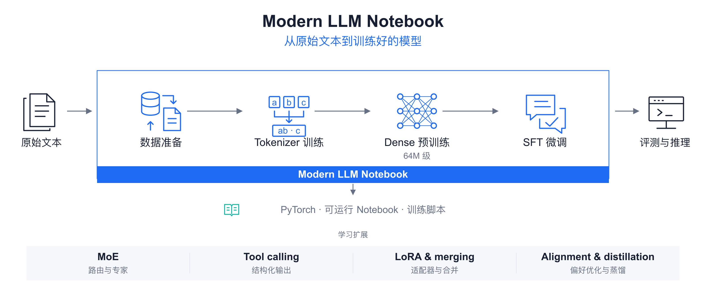
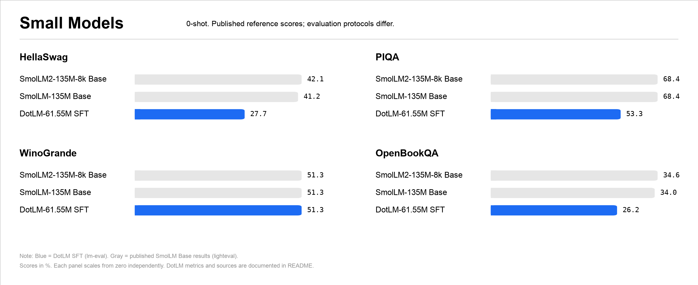
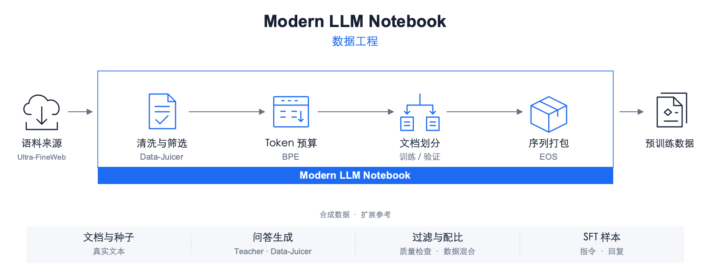
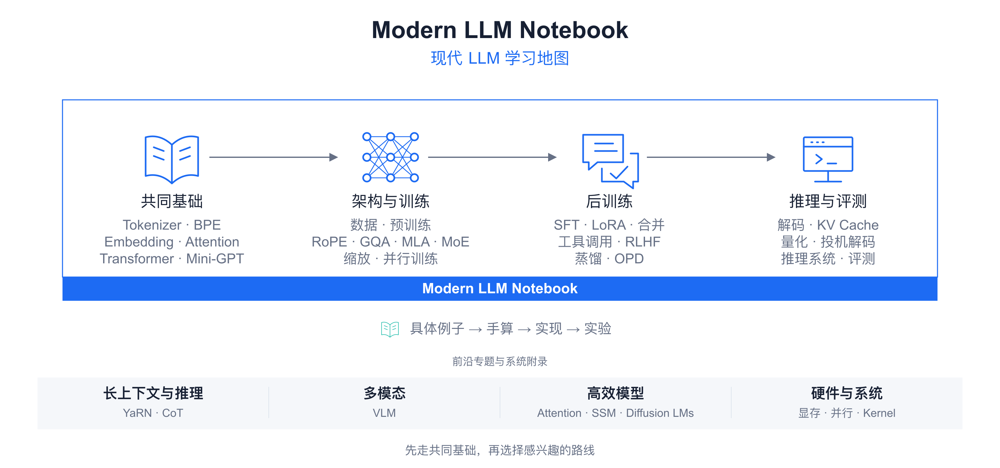

<p align="center">
  <a href="https://walkinglabs.github.io/modern-llm-notebook/">
    
  </a>
</p>

<h1 align="center">Modern LLM Notebook</h1>

<p align="center">
  <strong>用细致的例子和可运行实验，从零理解、实现与训练现代 LLM。</strong>
</p>

<p align="center">
  从原始文本清洗、BPE Tokenizer 训练，到 64M 级模型预训练与 SFT；
  继续探索 MoE、工具调用、小模型后训练与现代推理。
</p>

<p align="center">
  <a href="README.md"><strong>English</strong></a>
  ·
  <a href="README-CN.md"><strong>中文文档</strong></a>
  ·
  <a href="https://walkinglabs.github.io/modern-llm-notebook/"><strong>在线阅读</strong></a>
  ·
  <a href="https://colab.research.google.com/github/walkinglabs/modern-llm-notebook/blob/main/notebooks/part1-foundation/01-tokenizer-basics.ipynb"><strong>Colab 开始</strong></a>
  ·
  <a href="https://modelscope.cn/notebook/share/github/walkinglabs/modern-llm-notebook/blob/main/notebooks/part1-foundation/01-tokenizer-basics.ipynb"><strong>ModelScope</strong></a>
  ·
  <a href="https://developer.amd.com.cn/radeon/templates/4015/preview"><strong>AMD GPU 模板</strong></a>
  ·
  <a href="https://discord.gg/XU7DQmpqk"><strong>加入 Discord</strong></a>
</p>

<p align="center">
  <a href="https://github.com/walkinglabs/modern-llm-notebook/stargazers">
    
  </a>
  <a href="https://github.com/walkinglabs/modern-llm-notebook/actions/workflows/quality.yml">
    
  </a>
  <a href="https://github.com/walkinglabs/modern-llm-notebook/blob/main/LICENSE">
    
  </a>
  
  
  
</p>

<p align="center">
  <a href="#教程特色">教程特色</a> ·
  <a href="#从零到一个训练好的模型">训练流程</a> ·
  <a href="#模型与评测">模型与评测</a> ·
  <a href="#数据清洗与训练数据准备">数据清洗</a> ·
  <a href="#课程学习地图">学习地图</a> ·
  <a href="#notebook-目录">Notebook 目录</a> ·
  <a href="#快速开始">快速开始</a> ·
  <a href="#通过合作伙伴入口在线运行">合作伙伴</a> ·
  <a href="#项目状态">项目状态</a> ·
  <a href="#贡献">贡献</a>
</p>

## 快速开始

### 在线阅读

直接进入[在线阅读器](https://walkinglabs.github.io/modern-llm-notebook/)浏览教程，或在 [Google Colab](https://colab.research.google.com/github/walkinglabs/modern-llm-notebook/blob/main/notebooks/part1-foundation/01-tokenizer-basics.ipynb)运行第一本 Notebook。

### 通过合作伙伴入口在线运行

<p align="center">
  <a href="https://modelscope.cn/notebook/share/github/walkinglabs/modern-llm-notebook/blob/main/notebooks/part1-foundation/01-tokenizer-basics.ipynb">
    <picture>
      <source media="(prefers-color-scheme: dark)" srcset="assets/partners/modelscope-dark.svg">
      
    </picture>
  </a>
  &emsp;&emsp;
  <a href="https://developer.amd.com.cn/radeon/templates/4015/preview">
    <picture>
      <source media="(prefers-color-scheme: dark)" srcset="assets/partners/amd-dark.svg">
      
    </picture>
  </a>
</p>

欢迎随时打开这个项目，运行 Notebook、修改代码并测试实验结果。进入[在线阅读器](https://walkinglabs.github.io/modern-llm-notebook/)后，可以使用章节顶部的合作伙伴运行入口，无需先配置本地环境：

- [在 ModelScope 打开](https://modelscope.cn/notebook/share/github/walkinglabs/modern-llm-notebook/blob/main/notebooks/part1-foundation/01-tokenizer-basics.ipynb)：在线打开 Notebook 并运行代码；其他章节可以使用页面顶部对应的入口。
- [在 AMD 打开](https://developer.amd.com.cn/radeon/templates/4015/preview)：通过 AMD Radeon Cloud 的项目模板使用 GPU 运行和测试。
- [在 Colab 打开](https://colab.research.google.com/github/walkinglabs/modern-llm-notebook/blob/main/notebooks/part1-foundation/01-tokenizer-basics.ipynb)：在浏览器中运行 Notebook，也可按平台提供的资源选择 GPU。

感谢合作伙伴提供在线运行与计算资源支持。登录、GPU 可用性及使用额度以各平台当前规则为准。

## 教程特色

从几个词开始，逐次合并 BPE 字符对；用小矩阵算出 Attention 分数；观察第一次梯度更新前后的 loss。教程把这些过程拆成细小步骤，配合中间数值、张量形状和可运行实验，让每一步的结果都能看清。

- **细致的从零教学。** 按「直觉理解 → 手算验证 → 代码实现 → 实验观察」推进，用 PyTorch 从零实现核心组件。有 Python 和基本矩阵运算基础即可开始。
- **数据工程与真实训练。** 讲清语料来源、Data-Juicer 清洗、合成数据与配比，提供 DotLM 的 64M 级 Dense 预训练与监督微调（SFT）脚本，以及已有的 AMD MI300X 实验报告。
- **覆盖现代 LLM 的主要环节。** 从基础组件延伸到 RoPE、GQA、MLA、MoE、LoRA、工具调用、偏好对齐、蒸馏、量化与推理系统。

仓库是一套教学型参考实现：Notebook 用小例子解释机制，训练脚本与报告记录较完整的实验。中文是源版本，同时维护英文镜像；[在线阅读器](https://walkinglabs.github.io/modern-llm-notebook/)支持中英文切换。

## 从零到一个训练好的模型

<p align="center">
  <a href="assets/readme/training-workflow-cn.svg"></a>
</p>

沿主线可以学习从原始文本到模型训练的各个环节。底部展示 Dense 基线之外的扩展主题；下表分别说明可运行的训练脚本、Notebook 教学实现，以及待补齐的训练配方。

| 阶段 | 现在可以学习与运行什么 | 入口 |
|:---|:---|:---|
| 准备真实数据 | 下载中文语料，完成质量筛选、清洗、Token 计数、划分与打包 | [数据管线](llm_train/preprocess_ufw.py) · [数据工程教程](notebooks/part2-training/15-data-engineering.ipynb) |
| 训练 Tokenizer | 从 BPE 合并规则开始，训练词表并保存分词器 | [BPE 教程](notebooks/part1-foundation/02-bpe-tokenizer.ipynb) |
| Dense 模型预训练 | 从随机权重训练包含 RoPE、GQA、SwiGLU、QK-Norm 的模型；64M 级，报告中**实测 61.55M 参数** | [训练配置](llm_train/configs/firstllm_64m_exp24.yaml) · [预训练脚本](llm_train/train_pretrain.py) |
| 继续 SFT | 加载预训练 checkpoint，构造对话格式，只让 assistant 回答部分承担 loss | [SFT 脚本](llm_train/train_sft.py) · [预训练与微调教程](notebooks/part2-training/10-training-loss.ipynb) |
| 评测与诊断 | 查看验证集困惑度、benchmark、生成样例与失败记录 | [实验报告](llm_train/reports/exp24_repro_mini_seed42_report.md) · [评测教程](notebooks/part3-inference/25-evaluation.ipynb) |
| 小型 MoE | 已有路由与专家计算的教学实现；完整预训练配方待补齐 | [MoE 教程](notebooks/part2-training/13-moe.ipynb) |
| 工具调用 | 已有 Tool Call 数据构造与执行循环示例；端到端工具调用 SFT 待补齐 | [函数调用与 Agent](notebooks/part2-training/18-function-calling.ipynb) |
| 小模型后训练与合并 | 已有 LoRA、适配器合并、偏好目标与蒸馏讲解；小模型对照训练和更完整的合并配方待补齐 | [LoRA](notebooks/part2-training/16-lora.ipynb) · [偏好对齐](notebooks/part2-training/19-rlhf-alignment.ipynb) · [OPD](notebooks/part4-frontiers/31-opd.ipynb) |

## 模型与评测

**DotLM · 64M 级 Dense** 是这套教程的现代小模型训练基线：从随机权重出发，在清洗后的中文语料上完成预训练，再接续 assistant-only SFT。成绩表展示 mini 档 seed 42 的已有实验结果；图中同时列出两个小参数基模型的公开成绩，便于建立参考。

<p align="center">
  <a href="assets/readme/dotlm-benchmarks.svg"></a>
</p>

### 模型规格

| 配置 | DotLM · 64M 级 Dense |
|:---|:---|
| 架构 / 参数量 | Decoder-only Dense / **约 61.55M**（报告口径） |
| 层数 / Hidden size | 8 / 768 |
| Attention | GQA，8 个 Query head / 4 个 KV head，head dim 96 |
| FFN | SwiGLU，intermediate size 2304 |
| 位置编码 / 归一化 | RoPE（θ = 10,000）/ Pre-Norm RMSNorm + QK-Norm |
| 词表 / 权重共享 | 6,400 / Token Embedding 与 LM Head 共享 |
| 训练序列长度 / 精度 | 512 / BF16 |

[模型实现](llm_train/modeling_firstllm.py) · [训练配置](llm_train/configs/firstllm_64m_exp24.yaml) · [预训练](llm_train/train_pretrain.py) · [SFT](llm_train/train_sft.py) · [实验报告](llm_train/reports/exp24_repro_mini_seed42_report.md)

### 训练结果

| 阶段 | 数据 | 训练预算 | 已报告结果 |
|:---|:---|:---|:---|
| Pretraining | Ultra-FineWeb 中文，约 0.269B 训练集 Token | 5,120 步，batch 128；累计处理约 0.336B Token | Loss **8.93 → 2.74**；验证集 PPL **18.30 / 18.03** |
| SFT | BelleGroup `train_1M_CN`，917,424 条 | 2 epochs，28,668 步；batch 64 | Assistant-only loss **约 2.3 → 1.65** |

实验使用 AMD MI300X 单卡。两项 PPL 分别为打包序列与单文档独立评测口径；累计处理 Token 包含重复采样。此次训练沿用已有的 MiniMind 6,400 词表，教程中的从零 BPE 训练是独立实验。`mini` / `full` 使用相同架构；full 档目前提供配置，尚无完成报告。

### 评测成绩

使用 **[lm-evaluation-harness](https://github.com/EleutherAI/lm-evaluation-harness)** 评测 **DotLM 的 SFT 模型，0-shot**。分数单位为 %：`acc` 是选择准确率，`acc_norm` 按答案长度归一化打分后选择答案。

图中蓝色为 DotLM，灰色为 SmolLM Base 的公开参考成绩（[来源](https://huggingface.co/HuggingFaceTB/SmolLM2-135M#base-pre-trained-model)）。评测协议不同，尚未做同协议复测。

| 类别 | Benchmark | acc (%) | acc_norm (%) |
|:---|:---|---:|---:|
| 学科知识 | CEval-valid | **25.78** | — |
| 学科知识 | MMLU | **24.21** | — |
| 科学问答 | ARC Easy | 25.51 | 26.77 |
| 科学问答 | ARC Challenge | 19.97 | 21.76 |
| 常识推理 | PIQA | 53.97 | 53.26 |
| 科学问答 | OpenBookQA | 13.80 | 26.20 |
| 常识推理 | HellaSwag | 26.95 | 27.73 |
| 常识推理 | WinoGrande | 51.30 | — |

来源：[mini 档 seed 42 实验报告](llm_train/reports/exp24_repro_mini_seed42_report.md)。`—` 表示该指标未报告。

<details>
<summary>评测口径与复现方法</summary>

实验记录使用旧名 FirstLLM；下方脚本与 checkpoint 路径对应同一个模型。

| 评测项 | 口径 |
|:---|:---|
| Checkpoint | `firstllm_64m_exp24_sft/mini_seed42_sft.pt`，SFT 后模型 |
| 入口 | [run_lm_eval.sh](llm_train/scripts/run_lm_eval.sh)：将 `.pt` 导出为 Hugging Face 格式，再通过 `hf` 后端评测 |
| Few-shot / 后端 | `--num_fewshot 0`、`--model hf`、`trust_remote_code=True` |
| 当前脚本默认设置 | `--batch_size auto`、`--device cuda`；MI300X 通过 PyTorch ROCm 运行 |
| PPL 工具 | [run_ppl.py](llm_train/scripts/run_ppl.py)；使用 PT checkpoint，分别计算打包验证集与单文档独立口径 |

图中采用 DotLM 的 HellaSwag / PIQA / OpenBookQA `acc_norm` 和 WinoGrande `acc`。SmolLM 的公开成绩使用 **lighteval**，发布方的[任务定义](https://github.com/huggingface/smollm/blob/main/text/evaluation/smollm2/tasks.py)采用 `loglikelihood_acc_norm_nospace`。模型阶段、参数量、语料和指标实现不同，图中顺序只按公开分数排列。

CMMLU、Social IQa 未运行，GSM8K 未完成；报告仍记录了语义混乱和重复生成。正式报告未记录 lm-eval 的精确版本 / commit，复现时需保存工具版本和结果 JSON。

先准备报告对应的 SFT checkpoint 与 Tokenizer，并安装兼容的 lm-evaluation-harness / Hugging Face 依赖。以下命令运行已完成的 8 项任务：

```bash
CKPT=llm_train/checkpoints/firstllm_64m_exp24_sft/mini_seed42_sft.pt \
TOKENIZER=notebooks/part1-foundation/mini_tokenizer.json \
TASKS=ceval-valid,mmlu,arc_easy,arc_challenge,piqa,openbookqa,hellaswag,winogrande \
NUM_FEWSHOT=0 \
bash llm_train/scripts/run_lm_eval.sh
```

脚本会生成 HF 导出目录与 lm-eval 结果 JSON。评测版本、任务定义或数据集版本变化时，分数可能随之变化。

</details>

<details>
<summary>其他教学模型与实验状态</summary>

| 模型 / 实验 | 架构与参数量 | 已有结果 | 入口 |
|:---|:---|:---|:---|
| nanoGPT 字符级基线 | 2 层、64 hidden、2 heads；总参数 **108,352** | Tiny Shakespeare，500 步；train loss **2.2472**，val loss **2.2906** | [Mini-GPT](notebooks/part1-foundation/06-mini-gpt.ipynb) |
| 紧凑 Dense（历史短程实验） | 4 层、384 hidden、6Q / 2KV、FFN 1152；**约 9.34M** | PT / SFT 各 150 步；前后 10 步平均 loss：PT **7.4355 → 2.2707**，SFT **2.5253 → 2.1588** | [历史报告](llm_train/reports/station2_pt_sft_report.md) |
| MoE 教学实现 | Top-k 路由与专家 FFN | 已有组件实验；完整小参数模型预训练配方、参数量与成绩待补齐 | [MoE](notebooks/part2-training/13-moe.ipynb) |

nanoGPT 总参数包含 4,096 个位置 Embedding 参数；Notebook 默认打印的 104,256 不含该部分。9.34M 记录来自历史 Notebook 实验，当前没有独立 YAML 配置。这些实验使用不同数据和测量口径，loss 不适合直接横向比较。数据、中间产物与 checkpoint 需要自行准备，目前没有公开权重下载入口。

</details>

## 数据清洗与训练数据准备

<p align="center">
  <a href="assets/readme/data-pipeline-cn.svg"></a>
</p>

提供语料获取、Data-Juicer 清洗、Token 预算与序列打包，教程另含合成数据和配比示例。

[数据工程教程](notebooks/part2-training/15-data-engineering.ipynb) · [处理脚本](llm_train/preprocess_ufw.py) · [流程详解](#数据流程详解)

## 课程学习地图

<p align="center">
  <a href="assets/readme/learning-roadmap-cn.svg"></a>
</p>

主要内容：

- **模型训练**：BPE Tokenizer、Mini-GPT、数据准备、DotLM 预训练、SFT 与评测。
- **数据工程**：语料获取、Data-Juicer 清洗、合成数据、数据配比与 Packing。
- **模型架构**：RoPE、GQA、MLA、MoE、缩放定律与并行训练。
- **后训练与推理**：LoRA、模型合并、对齐、蒸馏、解码、KV Cache、量化与推理系统。

图示设计参考 [NVIDIA NeMo Framework](https://docs.nvidia.com/nemo-framework/index.html)，课程组织参考 [LLMs from Scratch](https://github.com/rasbt/LLMs-from-scratch) 和 [LLM Course](https://github.com/mlabonne/llm-course)。

## Notebook 目录

主体课程按四个部分组织。每个 Notebook 尽量自包含，可以顺序学习，也可以按主题查阅。

### Part 1: Foundation

| # | Notebook | 核心问题 | 实现重点 |
|:---:|:---|:---|:---|
| 01 | [文本与 Tokenizer](notebooks/part1-foundation/01-tokenizer-basics.ipynb) | 模型为什么需要 Tokenizer？ | 字符级和词级 Tokenizer |
| 02 | [BPE：子词词表学习](notebooks/part1-foundation/02-bpe-tokenizer.ipynb) | BPE 如何从语料里学习词表？ | Merge rules、encode、decode |
| 03 | [Token Embedding 与分布式表示](notebooks/part1-foundation/03-embedding.ipynb) | Token ID 如何变成向量？ | Token Embedding、分布式表示 |
| 04 | [位置编码](notebooks/part1-foundation/04-position-encoding.ipynb) | 模型如何感知词的顺序？ | 正弦位置编码、输入组装 |
| 05 | [Self-Attention 与 Transformer Block](notebooks/part1-foundation/05-transformer-block.ipynb) | Attention 如何搬运上下文信息？ | MHA、残差、归一化 |
| 06 | [从零实现 GPT](notebooks/part1-foundation/06-mini-gpt.ipynb) | GPT 风格模型如何组装起来？ | Decoder-only 模型、LM head |
| 07 | [BERT 编码器](notebooks/part1-foundation/07-bert-encoder.ipynb) | Encoder-only 模型为什么能双向读文本？ | MiniBERT、MLM head |

### Part 2: Training

| # | Notebook | 核心问题 | 实现重点 |
|:---:|:---|:---|:---|
| 08 | [现代语言模型架构演进](notebooks/part2-training/08-gpt2-to-modern-models.ipynb) | GPT-2 之后，现代模型在架构上改了什么？ | RMSNorm、SwiGLU、RoPE、GQA、QK-Norm、MLA |
| 09 | [读懂大模型的配置文件](notebooks/part2-training/09-model-config.ipynb) | 真实模型的 config.json 里每个字段是什么意思？ | vocab_size、hidden_size、layers、heads |
| 09a | [Loss 与第一次参数更新](notebooks/part2-training/09a-loss-and-first-update.ipynb) | 模型怎样从第一次错误中学习？ | logits、Cross-Entropy、梯度与参数更新 |
| 10 | [语言模型的预训练与微调](notebooks/part2-training/10-training-loss.ipynb) | MiniGPT 如何完成训练，并映射到工业训练接口？ | 训练循环、Chat Template、MTP、Trainer、SWIFT、标签偏移 |
| 11 | [KV Cache 及架构演进](notebooks/part2-training/11-mla-kv-cache.ipynb) | 长上下文下 KV Cache 怎么压？ | MHA/GQA/MQA 对比、MLA latent 压缩、decoupled RoPE |
| 12 | [分布式训练：工业界的标准工具链](notebooks/part2-training/12-distributed-training.ipynb) | 模型太大单卡装不下怎么办？ | Accelerate、ZeRO 参数、Megatron-LM 3D 并行、微调标配装备 |
| 13 | [从 dense 到 MoE 架构](notebooks/part2-training/13-moe.ipynb) | 稀疏专家路由如何工作？ | Router gate、top-k experts、无辅助 loss 负载均衡 |
| 14 | [缩放定律与算力预算](notebooks/part2-training/14-scaling-laws.ipynb) | 模型大小、数据量和算力如何权衡？ | 幂律、Kaplan/Chinchilla/过度训练、FLOPs/GPU-hours/显存估算 |
| 15 | [预训练数据工程](notebooks/part2-training/15-data-engineering.ipynb) | 训练数据从哪里来，怎样清洗、合成和配比？ | 语料来源、Data-Juicer、去重、合成、配比、Packing、FIM |
| 16 | [LoRA 低秩微调](notebooks/part2-training/16-lora.ipynb) | 低秩适配为什么有效？ | `LoraLinear`、merge 推理 |
| 17 | [知识蒸馏](notebooks/part2-training/17-distillation.ipynb) | 小模型如何学习大模型？ | 软标签、temperature、logit distillation |
| 18 | [函数调用与 Agent](notebooks/part2-training/18-function-calling.ipynb) | 模型如何调用外部工具？ | 结构化输出、Tool 调用、训练数据构造 |
| 19 | [偏好对齐与 RLHF](notebooks/part2-training/19-rlhf-alignment.ipynb) | 偏好信号如何变成优化目标？ | Reward Model、PPO、DPO |

### Part 3: Inference

| # | Notebook | 核心问题 | 实现重点 |
|:---:|:---|:---|:---|
| 20 | [解码策略](notebooks/part3-inference/20-generation.ipynb) | 解码策略如何改变模型行为？ | Greedy、top-k、top-p、Beam Search |
| 21 | [推理加速与优化](notebooks/part3-inference/21-inference-acceleration.ipynb) | 生成为什么常常受显存访问限制？ | KV Cache、FlashAttention、PagedAttention |
| 22 | [低比特量化](notebooks/part3-inference/22-quantization.ipynb) | 4-bit 量化为什么能保持精度？ | 对称/非对称、per-channel/group、GPTQ、AWQ |
| 23 | [投机解码的验证机制](notebooks/part3-inference/23-speculative-decoding.ipynb) | 小模型如何加速大模型？ | Draft-then-verify 接受率 |
| 24 | [现代推理引擎](notebooks/part3-inference/24-inference-systems.ipynb) | 多并发请求时吞吐和延迟怎么权衡？ | PagedAttention、Continuous batching、Prefix caching、Prefill/Decode 分离 |
| 25 | [评测方法论](notebooks/part3-inference/25-evaluation.ipynb) | 如何判断一个模型真的更好？ | 胜率矩阵、RAGAS、Judge 指标 |
| 26 | [模型部署与服务化](notebooks/part3-inference/26-llm-deployment.ipynb) | 训练好的模型如何变成可调用的服务？ | vLLM、SGLang、自定义架构注册 |

### Part 4: Frontiers

| # | Notebook | 核心问题 | 实现重点 |
|:---:|:---|:---|:---|
| 27 | [长上下文](notebooks/part4-frontiers/27-long-context.ipynb) | 模型如何扩展到训练长度之外？ | RoPE 外推、YaRN、Sliding Window Attention |
| 28 | [推理模型与推理时计算](notebooks/part4-frontiers/28-cot-thinking.ipynb) | 先想再答为什么更准？推理时多花算力还能提升多少？ | R1-Zero、Test-Time Scaling、思考预算控制 |
| 29 | [视觉语言模型](notebooks/part4-frontiers/29-vlm.ipynb) | 图像信息如何进入语言模型？ | Patch Embedding、Cross-Attention |
| 30 | [高效 Attention](notebooks/part4-frontiers/30-efficient-attention.ipynb) | 怎么把 attention 复杂度从 O(N²) 压到 O(N)？ | Linear attention、SSM/Mamba、稀疏注意力、Hybrid 架构 |
| 31 | [在线策略蒸馏（OPD）](notebooks/part4-frontiers/31-opd.ipynb) | 蒸馏如何减少 exposure bias？ | OPSD、KL 估计器分类 |

### 进阶附录

概率与信息论、FLOPs 与显存、混合精度、FlashAttention、集合通信、并行策略、Kernel、GPU 硬件与 Diffusion LM，见 [进阶附录目录](notebooks/appendix-advanced/)。

## 本地运行

### Python Notebook

```bash
git clone https://github.com/walkinglabs/modern-llm-notebook.git
cd modern-llm-notebook

# 创建独立 Python 环境，避免把依赖直接装进系统 Python。
python3 -m venv .venv
source .venv/bin/activate

python -m pip install --upgrade pip
python -m pip install -r requirements.txt
python -m ipykernel install --user \
  --name modern-llm-notebook \
  --display-name "Python (modern-llm-notebook)"

jupyter notebook notebooks/part1-foundation/01-tokenizer-basics.ipynb
```

如果出现 `jupyter: command not found`，通常是因为还没有激活虚拟环境。先运行：

```bash
source .venv/bin/activate
```

也可以直接调用虚拟环境里的 Jupyter：

```bash
.venv/bin/jupyter notebook notebooks/part1-foundation/01-tokenizer-basics.ipynb
```

语言说明：

- 中文版 Notebook：`notebooks/`
- 英文版 Notebook：`notebooks-en/`

推荐环境：

- Python 3.9+
- PyTorch 2.0+
- NumPy、Matplotlib、Jupyter
- 16GB RAM

大部分 Notebook 可以在 CPU 上运行。训练实验较重的章节建议使用 GPU。

<details>
<summary>网页阅读器开发与受限环境执行</summary>

### 网页阅读器

仓库里也包含一个 React / Vite 阅读器，可以用更接近课程网站的方式浏览 Notebook。
阅读器直接读取仓库中的 `.ipynb` 原文并在前端渲染，不维护额外的网页内容副本。

```bash
npm install
npm run dev
```

构建并预览静态网站：

```bash
npm run build
npm run preview
```

### 在受限环境中批量执行 Notebook（英文版）

有些沙箱/CI 环境会禁止打开本地 socket，这会导致标准的 Jupyter kernel 协议（以及 `nbclient`、
`nbconvert --execute`）执行失败。为这种场景仓库提供了一个「无 kernel 执行器」，用纯 Python 顺序执行
code cells，并把输出写回到英文版 notebook 文件：

```bash
python scripts/execute_notebooks_en_no_kernel.py
```

</details>

## 数据流程详解

<details>
<summary>数据来源、清洗步骤与合成参考</summary>

### 数据来源与清洗

DotLM 已有实验使用 **[Ultra-FineWeb](https://huggingface.co/datasets/openbmb/Ultra-FineWeb) 的中文分片**做预训练，使用 **[BelleGroup/train_1M_CN](https://huggingface.co/datasets/BelleGroup/train_1M_CN)** 做 SFT。[数据工程教程](notebooks/part2-training/15-data-engineering.ipynb)先介绍网页、百科、书籍、代码和领域语料，再讲数据筛选、清洗、合成与配比。

[preprocess_ufw.py](llm_train/preprocess_ufw.py)提供 `download`、`clean`、`truncate`、`pack` 四个命令，串起从原始语料到训练文件的流程。

| 步骤 | 具体操作 | 应检查的产物 |
|:---|:---|:---|
| 下载语料 | 从 `openbmb/Ultra-FineWeb` 获取中文分片 | 原始文本、质量分数、来源标签 |
| 质量筛选 | 将质量分数转成数值；mini 保留 `score ≥ 0.8`，full 保留 `≥ 0.7` | 保留文档及其分数分布 |
| 文本清洗 | 用 Data-Juicer 去除 HTML、修复 Unicode、规范空白、过滤长度 | 清洗后的 JSONL 与保留文档数 |
| 控制 Token 预算 | 用真实 BPE Token 计数，按分数顺序累加到预算 | 来源统计、截断 manifest |
| 准备训练文件 | 按文档划分训练/验证集，加入 EOS 边界并打包 Token 序列 | `train.bin`、`val.bin`、`val.jsonl` 与打包 manifest |

脚本生成 Data-Juicer YAML 配方，依次运行 `clean_html_mapper` → `fix_unicode_mapper` → `whitespace_normalization_mapper` → `text_length_filter`（100–8,000 字符）。这条管线依赖上游去重，跳过额外的 SimHash 去重。语料规模和最终保留量以生成的 manifest 为准。

### 合成数据与数据配比

教程讲解 **Self-Instruct、Evol-Instruct、教师蒸馏和 STaR**，用小例子展示生成与过滤。将这些方法接到 Data-Juicer 上，可以参考下面的路线：

| 步骤 | 具体做法 | 参考入口 |
|:---|:---|:---|
| 生成问答 | 从清洗后的文档出发，配置教师模型生成问题与答案 | Data-Juicer [generate_qa_from_text_mapper](https://github.com/datajuicer/data-juicer/blob/main/docs/operators/mapper/generate_qa_from_text_mapper.md) |
| 过滤与整理 | 去重、检查长度和答案质量、抽样复核，再将保留问答转成 SFT 对话格式 | [数据工程](notebooks/part2-training/15-data-engineering.ipynb) · [SFT 数据加载](llm_train/train_sft.py) |
| 配比与验证 | 将合成样本与真实数据混合，记录比例，用小规模训练和独立评测集检查效果 | [数据配方与采样](notebooks/part2-training/15-data-engineering.ipynb) |

**当前进度：**教程已有合成流程演示，训练管线已实现语料清洗。Data-Juicer 合成部分是扩展参考路线；DotLM 已发布的 SFT 成绩来自 Belle 数据。生成依赖和 YAML 执行方式可参考 [Data-Juicer 官方入门文档](https://github.com/datajuicer/data-juicer/blob/main/docs/tutorial/QuickStart.md)。

</details>

## 项目状态

| 模块 | 当前状态 |
|:---|:---|
| 课程 | 中文源 Notebook、英文镜像、四个主体部分与进阶系统附录 |
| Dense 训练 | `llm_train/` 已有数据处理、预训练、SFT、评测脚本与 64M 级实验记录 |
| 在线入口 | 双语阅读器、Colab / ModelScope Notebook 链接、AMD 项目模板 |
| 持续完善 | 细化讲解、同步双语内容、整理实验复现方式 |

### 后续训练实验

1. 整理 Dense 复现配方，统一 Tokenizer、数据 manifest、checkpoint 导出与完整评测。
2. 补齐小型 MoE 预训练配方，随配置公布总参数量与激活参数量。
3. 训练并评测小型工具调用模型，验证真实调用与错误恢复。
4. 为小模型的偏好训练、蒸馏与模型合并增加明确基线和对照实验。
5. 继续打磨具体例子、手算过程，以及数据与系统附录。

## 阅读器预览

<details>
<summary>展开查看双语课程阅读器</summary>

<p align="center">
  
</p>

<p align="center">
  <em>双语课程地图连接基础、训练、推理、前沿专题与系统内容。</em>
</p>

<p align="center">
  
</p>

<p align="center">
  <em>阅读器直接展示 Notebook，方便跟随直觉、手算、实现与实验的学习过程。</em>
</p>

</details>

## 更新日志

### 2026-08 · 推理篇（20-26）全面重写

第三部分「推理与部署」按照 Part 1 的叙事风格整体重建：每章开头先建立直觉再给方案，正文用问题链推进，结尾配小结 checklist 和 3 个可自测的作业。主要内容：

- **生成与解码（20）**：从贪心解码到采样策略的完整实现与实验
- **推理加速（21）**：KV Cache、算子融合、连续批处理等手段的效果观察
- **量化（22）**：扩展 FP8/FP4 浮点格式（含网格可视化实验）、GGUF 与 K-quant 细节、格式选择对照表；新增端到端实操——用 llm-compressor 产出 GPTQ/FP8、AutoAWQ 产出 AWQ、llama.cpp 转换并量化 GGUF，再逐个部署起来跑
- **投机解码的验证机制（23）**：可运行的 speculative sampling 循环，亲手验证接受率与加速比
- **现代推理引擎（24）**：batching 甘特图、paging、prefix caching 的模拟器实验；vLLM / SGLang 部署流程刷新
- **评测（25）**：评测流水线视角 + 常见 benchmark 的真实例题（MMLU / C-Eval / CMMLU / GSM8K / HumanEval）+ 评测库地图（lm-evaluation-harness / OpenCompass / 阿里 EvalScope）+ 置信区间；新增实战——把一套自制中文题库用 YAML 注册进 lm-eval，用 GPT-2 和 Qwen2.5-0.5B 真跑分，并画出技术报告风格的跑分图
- **部署（26）**：量化 checkpoint 直接上线（GPTQ/AWQ 离线、FP8 在线、llama-server），与上线前评测清单衔接

## 论文与系统

课程会把这些论文和系统中的关键设计拆成可运行的小实验：

| 论文或系统 | 覆盖概念 |
|:---|:---|
| Attention Is All You Need | Multi-Head Attention、Position Encoding |
| BERT | Encoder-only、Masked Language Modeling |
| LLaMA | RMSNorm、SwiGLU、RoPE、Pre-Norm |
| DeepSeek-V2 / DeepSeek-V3 | MLA、Multi-Token Prediction、无辅助 loss MoE 负载均衡 |
| Mixtral / Qwen3 | Sliding Window Attention、带共享专家的 MoE |
| Scaling Laws / Chinchilla | 参数、数据、算力权衡 |
| LoRA | Low-Rank Adaptation |
| RLHF / PPO / DPO | 偏好对齐 |
| Code Llama / DeepSeek-Coder | Fill-in-the-Middle（FIM） |
| FlashAttention / vLLM | 推理加速与显存管理 |
| Speculative Decoding | Draft-then-verify 生成 |
| RoPE / YaRN | 长上下文外推 |
| Chain-of-Thought | 推理链与 Self-Consistency |
| Flamingo / LLaVA | Vision-Language Models |
| Knowledge Distillation / OPD | 压缩与蒸馏 |

## 项目结构

```text
modern-llm-notebook/
├── notebooks/           # 中文源 Notebook
│   ├── part1-foundation/
│   ├── part2-training/
│   ├── part3-inference/
│   ├── part4-frontiers/
│   └── appendix-advanced/
├── notebooks-en/        # 英文镜像 Notebook
│   ├── part1-foundation/
│   ├── part2-training/
│   ├── part3-inference/
│   ├── part4-frontiers/
│   └── appendix-advanced/
├── llm_train/           # 数据处理、训练、评测与实验报告
├── assets/              # README 路线图与课程图片
├── web/                 # React / Vite 网页阅读器
├── docs/                # 静态网站构建产物
├── scripts/             # Notebook 转换脚本
├── requirements.txt
├── package.json
├── README.md
└── README-CN.md
```

## 贡献

欢迎贡献，尤其是能提升清晰度、正确性或覆盖面的改动。

适合贡献的内容包括：

- 修复解释错误、损坏的 cell 或过时 API。
- 改进手算过程和可视化。
- 增加带 assert 的小练习。
- 改进中英文文档。
- 为重要模型结构或训练方法提出新的 Notebook。

提交 PR 前请先阅读 [CONTRIBUTING.md](CONTRIBUTING.md)。

## Star History

<a href="https://www.star-history.com/#walkinglabs/modern-llm-notebook&Date">
  <picture>
    <source
      media="(prefers-color-scheme: dark)"
      srcset="https://api.star-history.com/svg?repos=walkinglabs/modern-llm-notebook&type=Date&theme=dark"
    >
    <source
      media="(prefers-color-scheme: light)"
      srcset="https://api.star-history.com/svg?repos=walkinglabs/modern-llm-notebook&type=Date"
    >
    
  </picture>
</a>

## 引用

如果 Modern LLM Notebook 对您的研究或工作有所帮助，欢迎引用：

```bibtex
@misc{modern-llm-notebook,
  title   = {Modern LLM Notebook: Build Modern LLMs from Scratch},
  author  = {WalkingLabs},
  year    = {2025},
  url     = {https://github.com/walkinglabs/modern-llm-notebook},
  note    = {GitHub repository, accessed 2026}
}
```

## 许可证

本项目采用
[Creative Commons Attribution-NonCommercial-ShareAlike 4.0 International License](LICENSE)
协议发布。

---

<p align="center">
  <sub>
    为想从内部理解 LLM 系统的工程师而构建。
    <br>
    由 <a href="https://github.com/walkinglabs">walkinglabs</a> 维护。
  </sub>
</p>
