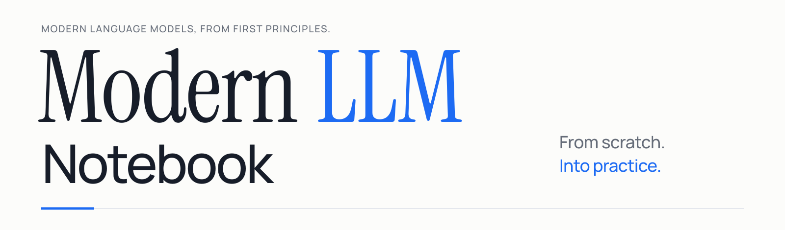
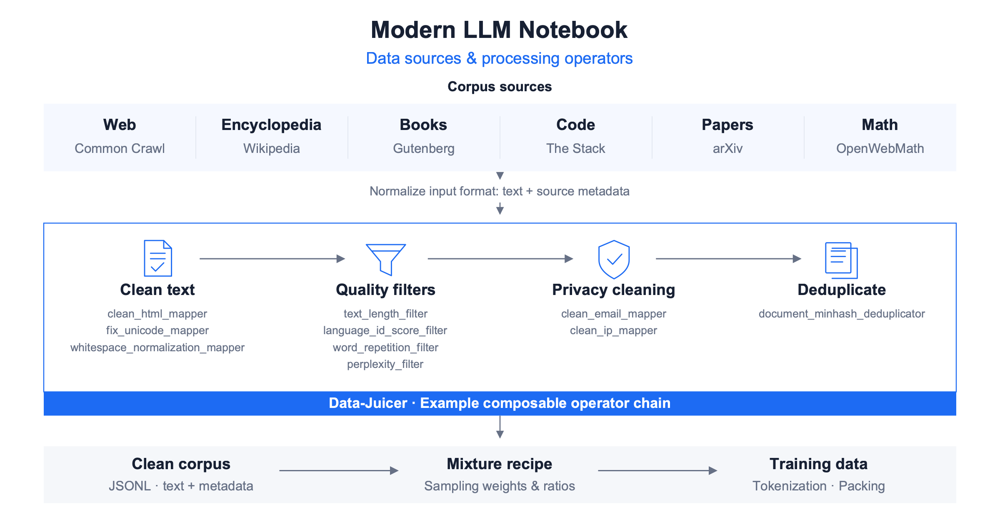
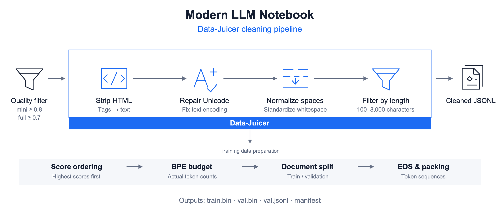

<p align="center">
  <a href="https://walkinglabs.github.io/modern-llm-notebook/?lang=en">
    <picture>
      <source media="(prefers-color-scheme: dark) and (max-width: 600px)" srcset="assets/brand/modern-llm-wordmark-compact-dark.svg">
      <source media="(max-width: 600px)" srcset="assets/brand/modern-llm-wordmark-compact.svg">
      <source media="(prefers-color-scheme: dark)" srcset="assets/brand/modern-llm-wordmark-dark.svg">
      
    </picture>
  </a>
</p>

<p align="center">
  <strong>Learn modern LLMs from scratch, one detailed example and experiment at a time.</strong>
</p>

<p align="center">
  Train a BPE tokenizer, prepare real data, and pretrain a 64M-class model.
  Continue with SFT, then explore MoE, tool calling, post-training, and inference.
</p>

<p align="center">
  <a href="README.md"><strong>English</strong></a>
  ·
  <a href="README-CN.md"><strong>中文文档</strong></a>
  ·
  <a href="https://walkinglabs.github.io/modern-llm-notebook/?lang=en"><strong>Read Online</strong></a>
  ·
  <a href="https://colab.research.google.com/github/walkinglabs/modern-llm-notebook/blob/main/notebooks-en/part1-foundation/01-tokenizer-basics.ipynb"><strong>Start in Colab</strong></a>
  ·
  <a href="https://modelscope.cn/notebook/share/github/walkinglabs/modern-llm-notebook/blob/main/notebooks-en/part1-foundation/01-tokenizer-basics.ipynb"><strong>ModelScope</strong></a>
  ·
  <a href="https://developer.amd.com.cn/radeon/templates/4015/preview"><strong>AMD GPU Template</strong></a>
  ·
  <a href="https://discord.gg/XU7DQmpqk"><strong>Join Discord</strong></a>
</p>

<p align="center">
  <a href="https://github.com/walkinglabs/modern-llm-notebook/stargazers">
    
  </a>
  <a href="https://github.com/walkinglabs/modern-llm-notebook/actions/workflows/quality.yml">
    
  </a>
  <a href="https://github.com/walkinglabs/modern-llm-notebook/blob/main/LICENSE">
    
  </a>
  
  
  
</p>

<p align="center">
  <a href="#course-preview">Preview</a> ·
  <a href="#what-makes-this-course-different">Approach</a> ·
  <a href="#from-zero-to-a-trained-model">Training Path</a> ·
  <a href="#models--benchmarks">Models &amp; Benchmarks</a> ·
  <a href="#data-preparation">Data Pipeline</a> ·
  <a href="#learning-roadmap">Roadmap</a> ·
  <a href="#curriculum">Curriculum</a> ·
  <a href="#quick-start">Quick Start</a> ·
  <a href="#run-online-through-partner-platforms">Partners</a> ·
  <a href="#project-status">Status</a> ·
  <a href="#contributing">Contributing</a>
</p>

## News

- **2026-09**: Added from-scratch training labs covering BPE tokenization, data cleaning, 64M-class DotLM pretraining, SFT, and evaluation, with reproduction scripts and experiment reports.
- **2026-08**: Reorganized the course into four parts, rebuilt the inference labs on decoding, acceleration, quantization, and deployment, and expanded post-training and diffusion LM topics.
- **2026-06**: Expanded MLA, distributed training, quantization, tool calling, and systems appendices, with runnable exercises and saved experiment outputs.
- **2026-05**: Launched bilingual notebooks and the online reader, covering the foundations from tokenization and Transformers to Mini-GPT.

## Quick Start

### Read Online

The easiest way to explore the course is through the published reader:

**[walkinglabs.github.io/modern-llm-notebook](https://walkinglabs.github.io/modern-llm-notebook/?lang=en)**

You can also open the first English notebook directly in
[Google Colab](https://colab.research.google.com/github/walkinglabs/modern-llm-notebook/blob/main/notebooks-en/part1-foundation/01-tokenizer-basics.ipynb).

### Run Online through Partner Platforms

<p align="center">
  <a href="https://modelscope.cn/notebook/share/github/walkinglabs/modern-llm-notebook/blob/main/notebooks-en/part1-foundation/01-tokenizer-basics.ipynb">
    <picture>
      <source media="(prefers-color-scheme: dark)" srcset="assets/partners/modelscope-dark.svg">
      
    </picture>
  </a>
  &emsp;&emsp;
  <a href="https://developer.amd.com.cn/radeon/templates/4015/preview">
    <picture>
      <source media="(prefers-color-scheme: dark)" srcset="assets/partners/amd-dark.svg">
      
    </picture>
  </a>
</p>

Everyone is welcome to open this project at any time, run the notebooks, change the code, and test the experiments. The [online reader](https://walkinglabs.github.io/modern-llm-notebook/?lang=en) provides partner launch buttons at the top of each chapter, so you can get started without setting up a local environment:

- [Open in ModelScope](https://modelscope.cn/notebook/share/github/walkinglabs/modern-llm-notebook/blob/main/notebooks-en/part1-foundation/01-tokenizer-basics.ipynb): open and run a notebook online. Use the chapter buttons for other notebooks.
- [Open in AMD](https://developer.amd.com.cn/radeon/templates/4015/preview): use the project template on AMD Radeon Cloud to run and test with a GPU.
- [Open in Colab](https://colab.research.google.com/github/walkinglabs/modern-llm-notebook/blob/main/notebooks-en/part1-foundation/01-tokenizer-basics.ipynb): run notebooks in your browser and select a GPU when the platform provides one.

Thank you to our partners for online execution and compute support. Sign-in requirements, GPU availability, and usage quotas follow each platform's current rules.

> [!NOTE]
> Modern LLM Notebook is under active development. The Chinese course is the source edition;
> the English mirror is being updated alongside it. Corrections, suggestions, and focused pull
> requests are welcome.

## What Makes This Course Different

Start with a few words, follow a BPE merge by hand, trace an attention score, and observe the first gradient update. The notebooks break these steps into small examples, with intermediate values, tensor shapes, and experiments that explain the result.

- **Detailed from-scratch teaching.** Build the core components in PyTorch through intuition, hand calculation, implementation, and observation. Basic Python and matrix operations are enough to begin.
- **Data engineering and real training.** Learn where corpora come from, how Data-Juicer cleans them, and how synthetic data and data mixtures work. Follow DotLM's 64M-class Dense pretraining → supervised fine-tuning (SFT) scripts, with an existing AMD MI300X experiment report.
- **Modern LLM topics in one course.** Extend the foundations to RoPE, GQA, MLA, MoE, LoRA, tool calling, preference alignment, distillation, quantization, and inference systems.

This is an educational reference: notebooks explain each mechanism, while the training scripts and reports document larger experiments. The Chinese notebooks are the source edition, with an English mirror and a bilingual [web reader](https://walkinglabs.github.io/modern-llm-notebook/?lang=en).

## From Zero to a Trained Model

<p align="center">
  <a href="assets/readme/training-workflow.svg"></a>
</p>

Follow the main path from raw text to a trained model. The lower strip shows the topics to explore beyond the Dense baseline; the table distinguishes runnable training scripts from notebook implementations and planned training recipes.

| Stage | What is available | Start here |
|:---|:---|:---|
| Prepare real data | Download, quality-filter, clean, count tokens, split, and pack a Chinese corpus | [Data pipeline](llm_train/preprocess_ufw.py) · [Data engineering](notebooks-en/part2-training/15-data-engineering.ipynb) |
| Train a tokenizer | Learn BPE merge rules, train a vocabulary, and save a tokenizer | [BPE notebook](notebooks-en/part1-foundation/02-bpe-tokenizer.ipynb) |
| Pretrain a Dense model | Train from random weights with RoPE, GQA, SwiGLU, and QK-Norm; 64M class, **61.55M measured parameters** in the reported run | [Configuration](llm_train/configs/firstllm_64m_exp24.yaml) · [Pretraining script](llm_train/train_pretrain.py) |
| Continue with SFT | Load the pretrained checkpoint, format conversations, and compute loss on assistant answers | [SFT script](llm_train/train_sft.py) · [Training notebook](notebooks-en/part2-training/10-training-loss.ipynb) |
| Evaluate and diagnose | Validation perplexity, benchmark results, generated examples, and documented failures | [Experiment report](llm_train/reports/exp24_repro_mini_seed42_report.md) · [Evaluation notebook](notebooks-en/part3-inference/25-evaluation.ipynb) |
| Study small MoE models | Implement routing and expert computation in a notebook; full MoE pretraining recipe is planned | [MoE notebook](notebooks-en/part2-training/13-moe.ipynb) |
| Explore tool calling | Construct tool-use examples and study the execution loop; end-to-end tool-use SFT is planned | [Function calling](notebooks-en/part2-training/18-function-calling.ipynb) |
| Extend post-training | Learn LoRA and adapter merging, preference objectives, and distillation; comparative small-model training and merging recipes are planned | [LoRA](notebooks-en/part2-training/16-lora.ipynb) · [Alignment](notebooks-en/part2-training/19-rlhf-alignment.ipynb) · [OPD](notebooks-en/part4-frontiers/31-opd.ipynb) |

## Models & Benchmarks

**DotLM · 64M-class Dense** is the course's modern small-model training baseline: pretrain from random weights on cleaned Chinese text, then continue with assistant-only SFT. The tables present the recorded mini-tier seed 42 results. The chart also includes two small Base models' published scores as references.

<p align="center">
  <a href="assets/readme/dotlm-benchmarks.svg"></a>
</p>

### Model Summary

| Setting | DotLM · 64M-class Dense |
|:---|:---|
| Architecture / parameters | Decoder-only Dense / **about 61.55M** (reported count) |
| Layers / hidden size | 8 / 768 |
| Attention | GQA, 8 query heads / 4 KV heads, head dimension 96 |
| FFN | SwiGLU, intermediate size 2304 |
| Position encoding / normalization | RoPE (θ = 10,000) / Pre-Norm RMSNorm + QK-Norm |
| Vocabulary / weight sharing | 6,400 / tied token embedding and LM head |
| Training sequence length / precision | 512 / BF16 |

[Model implementation](llm_train/modeling_firstllm.py) · [Configuration](llm_train/configs/firstllm_64m_exp24.yaml) · [Pretraining](llm_train/train_pretrain.py) · [SFT](llm_train/train_sft.py) · [Experiment report](llm_train/reports/exp24_repro_mini_seed42_report.md)

### Training Results

| Stage | Data | Training budget | Recorded results |
|:---|:---|:---|:---|
| Pretraining | Chinese Ultra-FineWeb, approximately 0.269B training-set tokens | 5,120 steps, batch 128; approximately 0.336B processed tokens | Loss **8.93 → 2.74**; validation PPL **18.30 / 18.03** |
| SFT | BelleGroup `train_1M_CN`, 917,424 records | 2 epochs, 28,668 steps; batch 64 | Assistant-only loss **about 2.3 → 1.65** |

The experiment used one AMD MI300X GPU. PPL values use packed-sequence and document-independent evaluation respectively; processed tokens include repeated sampling. This run uses an existing MiniMind tokenizer with a 6,400-token vocabulary; the from-scratch BPE lab is a separate experiment. `mini` and `full` share the architecture; the full tier currently has a configuration but no completed report.

### Evaluation Results

Evaluated with **[lm-evaluation-harness](https://github.com/EleutherAI/lm-evaluation-harness)** on the **DotLM SFT checkpoint · 0-shot**. Scores are percentages: `acc` is choice accuracy; `acc_norm` uses length-normalized answer scores.

The chart shows DotLM in blue and published SmolLM Base references in gray ([source](https://huggingface.co/HuggingFaceTB/SmolLM2-135M#base-pre-trained-model)). Evaluation protocols differ; these are reference scores, not a shared-protocol rerun.

| Category | Benchmark | acc (%) | acc_norm (%) |
|:---|:---|---:|---:|
| Knowledge | CEval-valid | **25.78** | — |
| Knowledge | MMLU | **24.21** | — |
| Science QA | ARC Easy | 25.51 | 26.77 |
| Science QA | ARC Challenge | 19.97 | 21.76 |
| Commonsense | PIQA | 53.97 | 53.26 |
| Science QA | OpenBookQA | 13.80 | 26.20 |
| Commonsense | HellaSwag | 26.95 | 27.73 |
| Commonsense | WinoGrande | 51.30 | — |

Source: [mini-tier seed 42 report](llm_train/reports/exp24_repro_mini_seed42_report.md). `—` means the metric was not reported.

<details>
<summary>Evaluation protocol and reproduction</summary>

The experiment records use the former name FirstLLM; the script and checkpoint paths below refer to the same model.

| Item | Protocol |
|:---|:---|
| Checkpoint | `firstllm_64m_exp24_sft/mini_seed42_sft.pt`, after SFT |
| Entry point | [run_lm_eval.sh](llm_train/scripts/run_lm_eval.sh): export `.pt` to Hugging Face format, then evaluate through the `hf` backend |
| Few-shot / backend | `--num_fewshot 0`, `--model hf`, `trust_remote_code=True` |
| Current script defaults | `--batch_size auto`, `--device cuda`; MI300X runs through PyTorch ROCm |
| PPL tool | [run_ppl.py](llm_train/scripts/run_ppl.py); PT checkpoint, with packed-validation and document-independent protocols |

The chart uses DotLM's `acc_norm` for HellaSwag / PIQA / OpenBookQA and `acc` for WinoGrande. SmolLM's published scores use **lighteval**; its [task definitions](https://github.com/huggingface/smollm/blob/main/text/evaluation/smollm2/tasks.py) use `loglikelihood_acc_norm_nospace`. Model stages, sizes, corpora, and metric implementations differ. Rows are ordered by published scores.

CMMLU and Social IQa were not run; GSM8K did not complete. The report also documents incoherent and repetitive generations. It does not record an exact lm-eval version / commit; save the tool version and result JSON when reproducing it.

Prepare the report's SFT checkpoint and matching tokenizer, and install compatible lm-evaluation-harness / Hugging Face dependencies. Run the eight completed tasks with:

```bash
CKPT=llm_train/checkpoints/firstllm_64m_exp24_sft/mini_seed42_sft.pt \
TOKENIZER=notebooks/part1-foundation/mini_tokenizer.json \
TASKS=ceval-valid,mmlu,arc_easy,arc_challenge,piqa,openbookqa,hellaswag,winogrande \
NUM_FEWSHOT=0 \
bash llm_train/scripts/run_lm_eval.sh
```

The script writes an HF export directory and lm-eval result JSON. Changes to evaluation versions, task definitions, or dataset versions may affect the scores.

</details>

<details>
<summary>Other teaching models and experiment status</summary>

| Model / experiment | Architecture and parameters | Recorded results | Entry point |
|:---|:---|:---|:---|
| Character-level nanoGPT | 2 layers, hidden size 64, 2 heads; **108,352 total parameters** | Tiny Shakespeare, 500 steps; train loss **2.2472**, validation loss **2.2906** | [Mini-GPT](notebooks-en/part1-foundation/06-mini-gpt.ipynb) · [Saved source outputs](notebooks/part1-foundation/06-mini-gpt.ipynb) |
| Compact Dense (historical short run) | 4 layers, hidden size 384, 6Q / 2KV, FFN 1152; **about 9.34M** | 150 steps each of PT / SFT; first-to-last 10-step mean loss: PT **7.4355 → 2.2707**, SFT **2.5253 → 2.1588** | [Historical report](llm_train/reports/station2_pt_sft_report.md) |
| MoE teaching implementation | Top-k routing and expert FFNs | Component experiments available; complete small-model pretraining recipe, parameter count, and results pending | [MoE](notebooks-en/part2-training/13-moe.ipynb) |

nanoGPT's total includes 4,096 position-embedding parameters; the notebook's default printed count of 104,256 excludes them. The 9.34M record comes from a historical notebook experiment and has no current standalone YAML recipe. These experiments use different data and measurement protocols, so their losses are not directly comparable. Data, intermediate artifacts, and checkpoints must be prepared locally; no public weight-download entry point is currently provided.

</details>

## Data Preparation

<p align="center">
  <a href="assets/readme/data-pipeline.svg"></a>
</p>

Corpus download, Data-Juicer cleaning, token budgeting, and sequence packing, with synthesis and data-mixing examples in the notebook.

[Data engineering notebook](notebooks-en/part2-training/15-data-engineering.ipynb) · [Processing script](llm_train/preprocess_ufw.py) · [Pipeline details](#data-pipeline-details)

## Learning Roadmap

<p align="center">
  <a href="assets/readme/learning-roadmap.svg"></a>
</p>

Topics covered:

- **Model training**: BPE tokenizers, Mini-GPT, data preparation, DotLM pretraining, SFT, and evaluation.
- **Data engineering**: corpus collection, Data-Juicer cleaning, synthetic data, data mixtures, and packing.
- **Model architectures**: RoPE, GQA, MLA, MoE, scaling laws, and parallel training.
- **Post-training and inference**: LoRA, model merging, alignment, distillation, decoding, KV cache, quantization, and inference systems.

## Curriculum

The main course is organized into four parts. Each notebook is intended to be self-contained: follow the sequence or look up a topic directly.

### Part 1: Foundation

| # | Notebook | Main question | Implementation focus |
|:---:|:---|:---|:---|
| 01 | [Text and Tokenizers](notebooks-en/part1-foundation/01-tokenizer-basics.ipynb) | Why does a model need a tokenizer? | Character-level and word-level tokenizers |
| 02 | [BPE: Learning a Subword Vocabulary](notebooks-en/part1-foundation/02-bpe-tokenizer.ipynb) | How does BPE learn a vocabulary from text? | Merge rules, encode, decode |
| 03 | [Token Embeddings and Distributed Representations](notebooks-en/part1-foundation/03-embedding.ipynb) | How do token IDs become vectors? | Token embeddings, distributed representations |
| 04 | [Position Encoding](notebooks-en/part1-foundation/04-position-encoding.ipynb) | How does the model represent word order? | Sinusoidal encoding, input assembly |
| 05 | [Self-Attention and Transformer Blocks](notebooks-en/part1-foundation/05-transformer-block.ipynb) | How does attention pass contextual information? | MHA, residual connections, normalization |
| 06 | [Build GPT from Scratch](notebooks-en/part1-foundation/06-mini-gpt.ipynb) | How are the components assembled into a GPT-style model? | Decoder-only model, LM head |
| 07 | [The BERT Encoder](notebooks-en/part1-foundation/07-bert-encoder.ipynb) | Why can an encoder read context in both directions? | MiniBERT, MLM head |

### Part 2: Training

| # | Notebook | Main question | Implementation focus |
|:---:|:---|:---|:---|
| 08 | [Modern Language Model Architecture Evolution](notebooks-en/part2-training/08-gpt2-to-modern-models.ipynb) | What changed in model architecture after GPT-2? | RMSNorm, SwiGLU, RoPE, GQA, QK-Norm, MLA |
| 09 | [Reading a Language Model's Configuration](notebooks-en/part2-training/09-model-config.ipynb) | What does each field in a real config.json mean? | vocab_size, hidden_size, layers, heads |
| 09a | [Loss and the First Parameter Update](notebooks-en/part2-training/09a-loss-and-first-update.ipynb) | How does a model learn from its first error? | Logits, cross-entropy, gradients, parameter updates |
| 10 | [Language Model Pretraining and Fine-tuning](notebooks-en/part2-training/10-training-loss.ipynb) | How does MiniGPT train, and how does that map to production interfaces? | Training loop, chat templates, MTP, Trainer, SWIFT, label shifting |
| 11 | [KV Cache and Architecture Evolution](notebooks-en/part2-training/11-mla-kv-cache.ipynb) | How can KV-cache memory be reduced for long contexts? | MHA/GQA/MQA, MLA latent compression, decoupled RoPE |
| 12 | [Distributed Training: The Production Toolchain](notebooks-en/part2-training/12-distributed-training.ipynb) | What if a model does not fit on one GPU? | Accelerate, ZeRO settings, Megatron-LM 3D parallelism, fine-tuning tools |
| 13 | [From Dense to MoE Architectures](notebooks-en/part2-training/13-moe.ipynb) | How does sparse expert routing work? | Router gates, top-k experts, auxiliary-loss-free balancing |
| 14 | [Scaling Laws and Compute Budgets](notebooks-en/part2-training/14-scaling-laws.ipynb) | How should model size, data, and compute be balanced? | Power laws, Kaplan/Chinchilla/overtraining, FLOPs/GPU-hours/memory estimates |
| 15 | [Pretraining Data Engineering](notebooks-en/part2-training/15-data-engineering.ipynb) | Where does training data come from, and how is it cleaned, synthesized, and mixed? | Corpus sources, Data-Juicer, deduplication, synthesis, mixtures, packing, FIM |
| 16 | [LoRA: Low-Rank Fine-tuning](notebooks-en/part2-training/16-lora.ipynb) | Why does low-rank adaptation work? | `LoraLinear`, merging for inference |
| 17 | [Knowledge Distillation](notebooks-en/part2-training/17-distillation.ipynb) | How can a small model learn from a larger one? | Soft labels, temperature, logit distillation |
| 18 | [Function Calling and Agents](notebooks-en/part2-training/18-function-calling.ipynb) | How does a model call external tools? | Structured output, tool calls, training-data construction |
| 19 | [Preference Alignment and RLHF](notebooks-en/part2-training/19-rlhf-alignment.ipynb) | How do preferences become optimization objectives? | Reward models, PPO, DPO |

### Part 3: Inference

| # | Notebook | Main question | Implementation focus |
|:---:|:---|:---|:---|
| 20 | [Decoding Strategies](notebooks-en/part3-inference/20-generation.ipynb) | How do decoding strategies change model behavior? | Greedy, top-k, top-p, beam search |
| 21 | [Inference Acceleration and Optimization](notebooks-en/part3-inference/21-inference-acceleration.ipynb) | Why is generation often limited by memory access? | KV cache, FlashAttention, PagedAttention |
| 22 | [Low-Bit Quantization](notebooks-en/part3-inference/22-quantization.ipynb) | How can 4-bit quantization retain accuracy? | Symmetric/asymmetric, per-channel/group, GPTQ, AWQ |
| 23 | [Verification in Speculative Decoding](notebooks-en/part3-inference/23-speculative-decoding.ipynb) | How can a small model accelerate a larger one? | Draft-then-verify acceptance |
| 24 | [Modern Inference Engines](notebooks-en/part3-inference/24-inference-systems.ipynb) | How are throughput and latency balanced with concurrent requests? | PagedAttention, continuous batching, prefix caching, prefill/decode disaggregation |
| 25 | [Model Evaluation Methodology](notebooks-en/part3-inference/25-evaluation.ipynb) | How do we know whether a model is really better? | Win-rate matrices, RAGAS, judge metrics |
| 26 | [Model Deployment and Serving](notebooks-en/part3-inference/26-llm-deployment.ipynb) | How does a trained model become a callable service? | vLLM, SGLang, custom architecture registration |

### Part 4: Frontiers

| # | Notebook | Main question | Implementation focus |
|:---:|:---|:---|:---|
| 27 | [Long Context](notebooks-en/part4-frontiers/27-long-context.ipynb) | How can a model extend beyond its training context length? | RoPE extrapolation, YaRN, sliding-window attention |
| 28 | [Reasoning Models and Inference-Time Compute](notebooks-en/part4-frontiers/28-cot-thinking.ipynb) | Why can thinking before answering improve accuracy, and how does extra inference compute help? | R1-Zero, test-time scaling, thinking-budget control |
| 29 | [Vision-Language Models](notebooks-en/part4-frontiers/29-vlm.ipynb) | How does visual information enter a language model? | Patch embeddings, cross-attention |
| 30 | [Efficient Attention](notebooks-en/part4-frontiers/30-efficient-attention.ipynb) | How can attention complexity fall from O(N²) to O(N)? | Linear attention, SSM/Mamba, sparse attention, hybrid architectures |
| 31 | [On-Policy Distillation (OPD)](notebooks-en/part4-frontiers/31-opd.ipynb) | How can distillation reduce exposure bias? | OPSD, KL estimator categories |

### Advanced Appendices

Probability and information theory, FLOPs and memory, mixed precision, FlashAttention, collective communication, parallelism, kernels, GPU hardware, and diffusion language models. See the [advanced appendix directory](notebooks-en/appendix-advanced/).

## Local Setup

### Run the Notebooks Locally

Requirements:

- Python 3.9+
- PyTorch 2.0+
- NumPy, Matplotlib, and Jupyter
- 16 GB RAM recommended

```bash
git clone https://github.com/walkinglabs/modern-llm-notebook.git
cd modern-llm-notebook

python3 -m venv .venv
source .venv/bin/activate

python -m pip install --upgrade pip
python -m pip install -r requirements.txt
python -m ipykernel install --user \
  --name modern-llm-notebook \
  --display-name "Python (modern-llm-notebook)"

jupyter notebook notebooks-en/part1-foundation/01-tokenizer-basics.ipynb
```

If `jupyter: command not found` appears, the virtual environment may not be active. Run:

```bash
source .venv/bin/activate
```

You can also invoke Jupyter directly from the virtual environment:

```bash
.venv/bin/jupyter notebook notebooks-en/part1-foundation/01-tokenizer-basics.ipynb
```

Most notebooks run on CPU. Experiments involving larger training workloads are easier with a GPU.

Language layout:

- Chinese source notebooks: `notebooks/`
- English notebook mirror: `notebooks-en/`

<details>
<summary>Web reader development and execution in restricted environments</summary>

### Run the Web Reader Locally

The React/Vite reader renders the original `.ipynb` files directly, so the website and notebooks
stay in sync.

```bash
npm install
npm run dev
```

Build and preview the static site:

```bash
npm run build
npm run preview
```

### Batch-Execute English Notebooks in Restricted Environments

Some sandbox or CI environments prohibit opening local sockets, which can prevent the standard Jupyter kernel protocol, `nbclient`, and `nbconvert --execute` from working. The repository provides a kernel-free runner for this case. It executes code cells sequentially in Python and writes their outputs back to the English notebook files:

```bash
python scripts/execute_notebooks_en_no_kernel.py
```

</details>

## Data Pipeline Details

<details>
<summary>Data sources, cleaning steps, and synthesis references</summary>

### Data Sources and Cleaning

<p align="center">
  <a href="assets/readme/data-cleaning.svg"></a>
</p>

DotLM's recorded run uses the Chinese shards of **[Ultra-FineWeb](https://huggingface.co/datasets/openbmb/Ultra-FineWeb)** for pretraining and **[BelleGroup/train_1M_CN](https://huggingface.co/datasets/BelleGroup/train_1M_CN)** for SFT. The [data engineering notebook](notebooks-en/part2-training/15-data-engineering.ipynb) introduces web, encyclopedic, book, code, and domain-specific corpora, then explains selection, cleaning, synthesis, and mixing.

The executable path in [preprocess_ufw.py](llm_train/preprocess_ufw.py) has four commands: `download`, `clean`, `truncate`, and `pack`.

| Step | Operation | Result to inspect |
|:---|:---|:---|
| Download | Fetch Chinese shards from `openbmb/Ultra-FineWeb` | Raw text, quality scores, and source labels |
| Quality filtering | Parse quality scores; keep `score ≥ 0.8` for mini or `≥ 0.7` for full | Retained documents and their score distribution |
| Cleaning | Use Data-Juicer for HTML removal, Unicode repair, whitespace normalization, and length filtering | Cleaned JSONL and retained document counts |
| Token budget | Count actual BPE tokens and retain documents in score order up to the tier budget | Per-source statistics and a truncation manifest |
| Training preparation | Split documents into training/validation sets, add EOS boundaries, and pack token sequences | `train.bin`, `val.bin`, `val.jsonl`, and a packing manifest |

The script writes a Data-Juicer YAML recipe with `clean_html_mapper` → `fix_unicode_mapper` → `whitespace_normalization_mapper` → `text_length_filter` (100–8,000 characters). It relies on upstream deduplication and skips an additional SimHash pass. Dataset scale and retained counts come from the generated manifests.

### Synthetic Data and Data Mixtures

The notebook explains **Self-Instruct, Evol-Instruct, teacher distillation, and STaR**, with small examples of generation and filtering. To extend this into a Data-Juicer synthesis pipeline, use the following reference route:

| Step | What to do | Reference |
|:---|:---|:---|
| Generate QA pairs | Start from cleaned documents; configure a teacher model to generate questions and answers | Data-Juicer [generate_qa_from_text_mapper](https://github.com/datajuicer/data-juicer/blob/main/docs/operators/mapper/generate_qa_from_text_mapper.md) |
| Filter and format | Deduplicate, check length and answer quality, inspect samples, and convert retained pairs into the SFT conversation format | [Data engineering](notebooks-en/part2-training/15-data-engineering.ipynb) · [SFT data loader](llm_train/train_sft.py) |
| Mix and validate | Mix retained synthetic examples with real data, record the proportions, and compare a small training run on held-out tasks | [Data recipes and sampling](notebooks-en/part2-training/15-data-engineering.ipynb) |

**Current status:** the notebook contains synthesis demonstrations; the training pipeline implements corpus cleaning. Data-Juicer synthesis is an extension reference, and DotLM's reported SFT results use Belle data. Consult the official [Data-Juicer quick start](https://github.com/datajuicer/data-juicer/blob/main/docs/tutorial/QuickStart.md) for generation dependencies and YAML execution.

</details>

## Project Status

| Area | Current status |
|:---|:---|
| Course | Chinese source notebooks, English mirror, four main parts, and advanced systems appendices |
| Dense training | Data processing, pretraining, SFT, evaluation scripts, and a recorded 64M-class experiment in `llm_train/` |
| Online access | Bilingual reader, Colab / ModelScope notebook links, and AMD project template |
| Development | Active updates to explanations, bilingual consistency, and experiment reproduction |

### Next Training Experiments

- Consolidate the Dense recipe with consistent tokenizer, data manifests, checkpoint export, and complete evaluation.
- Add a small MoE pretraining recipe and publish both total and active parameter counts with its configuration.
- Train and evaluate a small tool-calling model, including executable calls and recovery from errors.
- Compare small-model preference training, distillation, and model merging against explicit baselines.
- Continue refining the examples, hand calculations, and data / systems appendices.

## Course Preview

<details>
<summary>Preview the bilingual course reader</summary>

<p align="center">
  
</p>

<p align="center">
  <em>A bilingual course map connects foundations, training, inference, frontier topics,
  and production systems.</em>
</p>

<p align="center">
  
</p>

<p align="center">
  <em>Every notebook keeps the learning loop visible: intuition, hand calculation,
  implementation, and experiment.</em>
</p>

</details>

## Papers and Systems

The course connects readable implementations to influential papers and production systems:

| Paper or system | Concepts covered |
|:---|:---|
| Attention Is All You Need | Multi-Head Attention, position encoding |
| BERT | Encoder-only models, masked language modeling |
| LLaMA | RMSNorm, SwiGLU, RoPE, Pre-Norm |
| DeepSeek-V2 / DeepSeek-V3 | MLA, multi-token prediction, auxiliary-loss-free MoE load balancing |
| Mixtral / Qwen3 | Sliding-window attention, MoE with shared experts |
| Scaling Laws / Chinchilla | Parameter, data, and compute trade-offs |
| LoRA | Low-rank adaptation |
| RLHF / PPO / DPO | Preference alignment |
| Code Llama / DeepSeek-Coder | Fill-in-the-Middle |
| FlashAttention / vLLM | Inference acceleration and memory management |
| Speculative Decoding | Draft-and-verify generation |
| RoPE / YaRN | Long-context extrapolation |
| Chain-of-Thought | Reasoning traces and Self-Consistency |
| Flamingo / LLaVA | Vision-language modeling |
| Knowledge Distillation / OPD | Model compression and behavior transfer |

## Repository Structure

```text
modern-llm-notebook/
├── notebooks/           # Chinese source notebooks
│   ├── part1-foundation/
│   ├── part2-training/
│   ├── part3-inference/
│   ├── part4-frontiers/
│   └── appendix-advanced/
├── notebooks-en/        # English notebook mirror
│   ├── part1-foundation/
│   ├── part2-training/
│   ├── part3-inference/
│   ├── part4-frontiers/
│   └── appendix-advanced/
├── llm_train/           # Data processing, training, evaluation, and experiment reports
├── assets/              # README and course assets
├── web/                 # React/Vite course reader
├── docs/                # Static website build output
├── scripts/             # Notebook maintenance and verification scripts
├── requirements.txt
├── package.json
├── README.md
└── README-CN.md
```

## Contributing

Contributions are welcome when they make the course clearer, more accurate, easier to reproduce,
or easier to navigate.

Good contributions include:

- Fixing incorrect explanations, broken cells, or outdated APIs.
- Improving hand calculations and visualizations.
- Adding small exercises with assertions.
- Improving the Chinese and English documentation.
- Proposing a notebook for an important model architecture, training method, or system.

Please keep pull requests focused and read [CONTRIBUTING.md](CONTRIBUTING.md) before submitting one.

## Star History

<a href="https://www.star-history.com/#walkinglabs/modern-llm-notebook&Date">
  <picture>
    <source
      media="(prefers-color-scheme: dark)"
      srcset="https://api.star-history.com/svg?repos=walkinglabs/modern-llm-notebook&type=Date&theme=dark"
    >
    <source
      media="(prefers-color-scheme: light)"
      srcset="https://api.star-history.com/svg?repos=walkinglabs/modern-llm-notebook&type=Date"
    >
    
  </picture>
</a>

## Citation

If Modern LLM Notebook helps your research, teaching, or work, please cite:

```bibtex
@misc{modern-llm-notebook,
  title   = {Modern LLM Notebook: Build Modern LLMs from Scratch},
  author  = {WalkingLabs},
  year    = {2025},
  url     = {https://github.com/walkinglabs/modern-llm-notebook},
  note    = {GitHub repository, accessed 2026}
}
```

## License

This course is released under the
[Creative Commons Attribution-NonCommercial-ShareAlike 4.0 International License](LICENSE).

---

<p align="center">
  <sub>
    Built for engineers who want to understand LLM systems from the inside.
    <br>
    Maintained by <a href="https://github.com/walkinglabs">WalkingLabs</a>.
  </sub>
</p>
