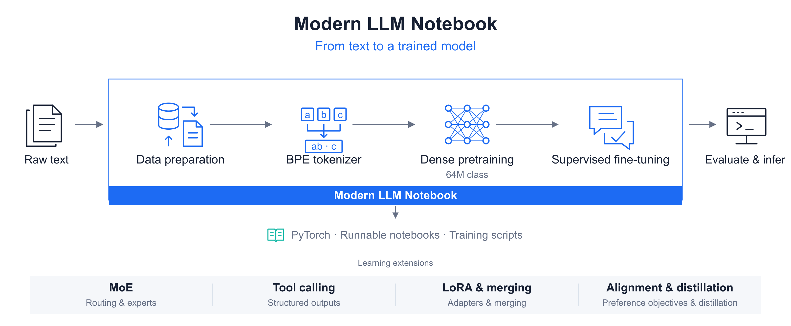
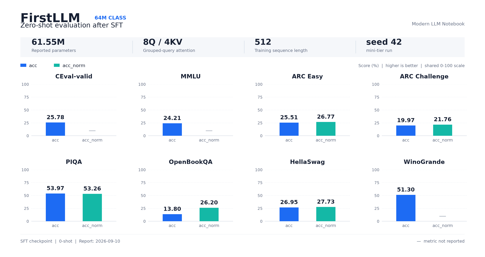
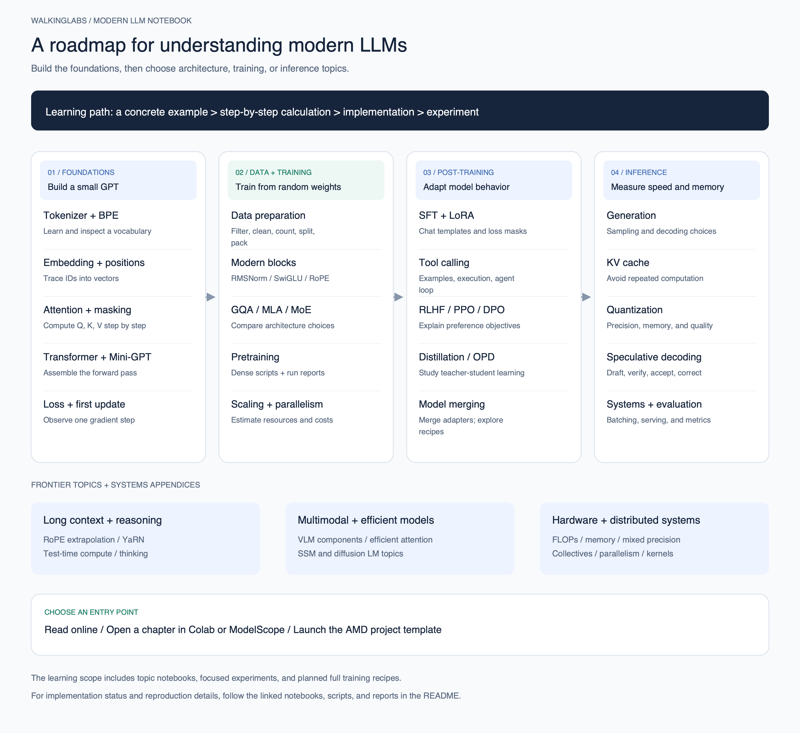

<p align="center">
  <a href="https://walkinglabs.github.io/modern-llm-notebook/">
    
  </a>
</p>

<h1 align="center">Modern LLM Notebook</h1>

<p align="center">
  <strong>Learn modern LLMs from scratch, one detailed example and experiment at a time.</strong>
</p>

<p align="center">
  Train a BPE tokenizer, prepare real data, and pretrain a 64M-class model.
  Continue with SFT, then explore MoE, tool calling, post-training, and inference.
</p>

<p align="center">
  <a href="README.md"><strong>English</strong></a>
  ·
  <a href="README-CN.md"><strong>中文文档</strong></a>
  ·
  <a href="https://walkinglabs.github.io/modern-llm-notebook/"><strong>Read Online</strong></a>
  ·
  <a href="https://colab.research.google.com/github/walkinglabs/modern-llm-notebook/blob/main/notebooks-en/part1-foundation/01-tokenizer-basics.ipynb"><strong>Start in Colab</strong></a>
  ·
  <a href="https://modelscope.cn/notebook/share/github/walkinglabs/modern-llm-notebook/blob/main/notebooks-en/part1-foundation/01-tokenizer-basics.ipynb"><strong>ModelScope</strong></a>
  ·
  <a href="https://developer.amd.com.cn/radeon/templates/4015/preview"><strong>AMD GPU Template</strong></a>
  ·
  <a href="https://discord.gg/XU7DQmpqk"><strong>Join Discord</strong></a>
</p>

<p align="center">
  <a href="https://github.com/walkinglabs/modern-llm-notebook/stargazers">
    
  </a>
  <a href="https://github.com/walkinglabs/modern-llm-notebook/actions/workflows/quality.yml">
    
  </a>
  <a href="https://github.com/walkinglabs/modern-llm-notebook/blob/main/LICENSE">
    
  </a>
  
  
  
</p>

<p align="center">
  <a href="#course-preview">Preview</a> ·
  <a href="#what-makes-this-course-different">Approach</a> ·
  <a href="#from-zero-to-a-trained-model">Training Path</a> ·
  <a href="#models--benchmarks">Models &amp; Benchmarks</a> ·
  <a href="#data-preparation">Data Pipeline</a> ·
  <a href="#learning-roadmap">Roadmap</a> ·
  <a href="#curriculum">Curriculum</a> ·
  <a href="#quick-start">Quick Start</a> ·
  <a href="#run-online-through-partner-platforms">Partners</a> ·
  <a href="#project-status">Status</a> ·
  <a href="#contributing">Contributing</a>
</p>

> [!NOTE]
> Modern LLM Notebook is under active development. The Chinese course is the source edition;
> the English mirror is being updated alongside it. Corrections, suggestions, and focused pull
> requests are welcome.

## What Makes This Course Different

Start with a few words, follow a BPE merge by hand, trace an attention score, and observe the first gradient update. The notebooks break these steps into small examples, with intermediate values, tensor shapes, and experiments that explain the result.

- **Detailed from-scratch teaching.** Build the core components in PyTorch through intuition, hand calculation, implementation, and observation. Basic Python and matrix operations are enough to begin.
- **Real data and training.** Follow the data preparation pipeline and the 64M-class Dense pretraining → supervised fine-tuning (SFT) scripts, with an existing AMD MI300X experiment report.
- **Modern LLM topics in one course.** Extend the foundations to RoPE, GQA, MLA, MoE, LoRA, tool calling, preference alignment, distillation, quantization, and inference systems.

This is an educational reference: notebooks explain each mechanism, while the training scripts and reports document larger experiments. The Chinese notebooks are the source edition, with an English mirror and a bilingual [web reader](https://walkinglabs.github.io/modern-llm-notebook/?lang=en).

## From Zero to a Trained Model

<p align="center">
  <a href="assets/readme/training-workflow.svg"></a>
</p>

Follow the main path from raw text to a trained model. The lower strip shows the topics to explore beyond the Dense baseline; the table distinguishes runnable training scripts from notebook implementations and planned training recipes.

| Stage | What is available | Start here |
|:---|:---|:---|
| Prepare real data | Download, quality-filter, clean, count tokens, split, and pack a Chinese corpus | [Data pipeline](llm_train/preprocess_ufw.py) · [Data engineering](notebooks-en/part2-training/15-data-engineering.ipynb) |
| Train a tokenizer | Learn BPE merge rules, train a vocabulary, and save a tokenizer | [BPE notebook](notebooks-en/part1-foundation/02-bpe-tokenizer.ipynb) |
| Pretrain a Dense model | Train from random weights with RoPE, GQA, SwiGLU, and QK-Norm; 64M class, **61.55M measured parameters** in the reported run | [Configuration](llm_train/configs/firstllm_64m_exp24.yaml) · [Pretraining script](llm_train/train_pretrain.py) |
| Continue with SFT | Load the pretrained checkpoint, format conversations, and compute loss on assistant answers | [SFT script](llm_train/train_sft.py) · [Training notebook](notebooks-en/part2-training/10-training-loss.ipynb) |
| Evaluate and diagnose | Validation perplexity, benchmark results, generated examples, and documented failures | [Experiment report](llm_train/reports/exp24_repro_mini_seed42_report.md) · [Evaluation notebook](notebooks-en/part3-inference/25-evaluation.ipynb) |
| Study small MoE models | Implement routing and expert computation in a notebook; full MoE pretraining recipe is planned | [MoE notebook](notebooks-en/part2-training/13-moe.ipynb) |
| Explore tool calling | Construct tool-use examples and study the execution loop; end-to-end tool-use SFT is planned | [Function calling](notebooks-en/part2-training/18-function-calling.ipynb) |
| Extend post-training | Learn LoRA and adapter merging, preference objectives, and distillation; comparative small-model training and merging recipes are planned | [LoRA](notebooks-en/part2-training/16-lora.ipynb) · [Alignment](notebooks-en/part2-training/19-rlhf-alignment.ipynb) · [OPD](notebooks-en/part4-frontiers/31-opd.ipynb) |

## Models & Benchmarks

**FirstLLM · 64M-class Dense** is the course's modern small-model training baseline: pretrain from random weights on cleaned Chinese text, then continue with assistant-only SFT. The chart and tables present the recorded mini-tier seed 42 results.

<p align="center">
  <a href="assets/readme/firstllm-benchmarks.svg"></a>
</p>

### Model Summary

| Setting | FirstLLM · 64M-class Dense |
|:---|:---|
| Architecture / parameters | Decoder-only Dense / **about 61.55M** (reported count) |
| Layers / hidden size | 8 / 768 |
| Attention | GQA, 8 query heads / 4 KV heads, head dimension 96 |
| FFN | SwiGLU, intermediate size 2304 |
| Position encoding / normalization | RoPE (θ = 10,000) / Pre-Norm RMSNorm + QK-Norm |
| Vocabulary / weight sharing | 6,400 / tied token embedding and LM head |
| Training sequence length / precision | 512 / BF16 |

[Model implementation](llm_train/modeling_firstllm.py) · [Configuration](llm_train/configs/firstllm_64m_exp24.yaml) · [Pretraining](llm_train/train_pretrain.py) · [SFT](llm_train/train_sft.py) · [Experiment report](llm_train/reports/exp24_repro_mini_seed42_report.md)

### Training Results

| Stage | Data | Training budget | Recorded results |
|:---|:---|:---|:---|
| Pretraining | Chinese Ultra-FineWeb, approximately 0.269B training-set tokens | 5,120 steps, batch 128; approximately 0.336B processed tokens | Loss **8.93 → 2.74**; validation PPL **18.30 / 18.03** |
| SFT | BelleGroup `train_1M_CN`, 917,424 records | 2 epochs, 28,668 steps; batch 64 | Assistant-only loss **about 2.3 → 1.65** |

The experiment used one AMD MI300X GPU. PPL values use packed-sequence and document-independent evaluation respectively; processed tokens include repeated sampling. This run uses an existing MiniMind tokenizer with a 6,400-token vocabulary; the from-scratch BPE lab is a separate experiment. `mini` and `full` share the architecture; the full tier currently has a configuration but no completed report.

### Evaluation Results

Results below are for the **SFT checkpoint · 0-shot**, in percent. `acc` is choice accuracy; `acc_norm` chooses answers using length-normalized scores. The chart's two colors identify metrics, not different models.

| Category | Benchmark | acc (%) | acc_norm (%) |
|:---|:---|---:|---:|
| Knowledge | CEval-valid | **25.78** | — |
| Knowledge | MMLU | **24.21** | — |
| Science QA | ARC Easy | 25.51 | 26.77 |
| Science QA | ARC Challenge | 19.97 | 21.76 |
| Commonsense | PIQA | 53.97 | 53.26 |
| Science QA | OpenBookQA | 13.80 | 26.20 |
| Commonsense | HellaSwag | 26.95 | 27.73 |
| Commonsense | WinoGrande | 51.30 | — |

Source: [mini-tier seed 42 report](llm_train/reports/exp24_repro_mini_seed42_report.md). `—` means the metric was not reported. CMMLU and Social IQa were not run; GSM8K did not complete. These results help study educational models, and the reports still document incoherent and repetitive generations. Cross-model comparisons require matching tokenizers, data, and evaluation protocols.

<details>
<summary>Other teaching models and experiment status</summary>

| Model / experiment | Architecture and parameters | Recorded results | Entry point |
|:---|:---|:---|:---|
| Character-level nanoGPT | 2 layers, hidden size 64, 2 heads; **108,352 total parameters** | Tiny Shakespeare, 500 steps; train loss **2.2472**, validation loss **2.2906** | [Mini-GPT](notebooks-en/part1-foundation/06-mini-gpt.ipynb) · [Saved source outputs](notebooks/part1-foundation/06-mini-gpt.ipynb) |
| Compact Dense (historical short run) | 4 layers, hidden size 384, 6Q / 2KV, FFN 1152; **about 9.34M** | 150 steps each of PT / SFT; first-to-last 10-step mean loss: PT **7.4355 → 2.2707**, SFT **2.5253 → 2.1588** | [Historical report](llm_train/reports/station2_pt_sft_report.md) |
| MoE teaching implementation | Top-k routing and expert FFNs | Component experiments available; complete small-model pretraining recipe, parameter count, and results pending | [MoE](notebooks-en/part2-training/13-moe.ipynb) |

nanoGPT's total includes 4,096 position-embedding parameters; the notebook's default printed count of 104,256 excludes them. The 9.34M record comes from a historical notebook experiment and has no current standalone YAML recipe. These experiments use different data and measurement protocols, so their losses are not directly comparable. Data, intermediate artifacts, and checkpoints must be prepared locally; no public weight-download entry point is currently provided.

</details>

## Data Preparation

The executable path in [preprocess_ufw.py](llm_train/preprocess_ufw.py) has four commands: `download`, `clean`, `truncate`, and `pack`.

| Step | Operation | Result to inspect |
|:---|:---|:---|
| Download | Fetch Chinese shards from `openbmb/Ultra-FineWeb` | Raw text, quality scores, and source labels |
| Quality filtering | Convert quality scores to numbers and apply the tier threshold | Retained documents and their score distribution |
| Cleaning | Use Data-Juicer for HTML removal, Unicode repair, whitespace normalization, and length filtering | Cleaned JSONL and retained document counts |
| Token budget | Count actual BPE tokens and retain documents in score order up to the tier budget | Per-source statistics and a truncation manifest |
| Training preparation | Split documents into training/validation sets, add EOS boundaries, and pack token sequences | `train.bin`, `val.bin`, `val.jsonl`, and a packing manifest |

The [data engineering notebook](notebooks-en/part2-training/15-data-engineering.ipynb) also explains deduplication and data quality. This particular Ultra-FineWeb pipeline relies on upstream deduplication and deliberately skips an additional SimHash pass; its code comments document the observed false deletions. Dataset scale and retained counts should always come from the generated manifests.

## Learning Roadmap

<p align="center">
  <a href="assets/readme/learning-roadmap.svg"></a>
</p>

The four stages connect the shared foundations to architecture and training, post-training, and inference and evaluation. Frontier topics and hardware appendices extend this path.

Follow the foundations first, then choose a route:

- **Train a model:** BPE → Mini-GPT → loss and first update → data preparation → Dense pretraining → SFT → evaluation.
- **Understand modern architectures:** modern blocks → GQA / MLA → MoE → scaling and parallelism.
- **Improve and serve a model:** LoRA / alignment / distillation → generation → KV Cache → quantization → inference systems.

The map shows the learning scope. The table above distinguishes available experiments from planned full training recipes. Both diagrams use a shared visual layout inspired by [NVIDIA NeMo Framework](https://docs.nvidia.com/nemo-framework/index.html); the learning roadmap also draws on the course organization of [LLMs from Scratch](https://github.com/rasbt/LLMs-from-scratch) and [LLM Course](https://github.com/mlabonne/llm-course). Both are original diagrams of this repository's own content.

## Curriculum

The curriculum is organized into four progressive parts. Each notebook is self-contained, so you
can follow the full sequence or jump directly to a topic.

| Part | Focus | Main topics |
|:---|:---|:---|
| I. Foundations | Build the model core | Tokenizer, BPE, Embedding, position encoding, Self-Attention, Transformer, GPT from scratch, BERT |
| II. Training | Learn how models improve | Modern architecture evolution, configuration, pretraining and fine-tuning, KV cache evolution, distributed training, MoE, scaling laws, data engineering, LoRA, distillation, function calling, RLHF |
| III. Inference | Generate, evaluate, and deploy | Decoding strategies, inference acceleration, quantization, speculative decoding, inference systems, evaluation, deployment |
| IV. Frontiers | Explore newer capabilities | Long context, CoT and reasoning, VLMs, efficient attention, on-policy distillation |

### Recommended Learning Path

1. Start with Tokenizer and BPE to see how text becomes model input.
2. Build Embedding, position encoding, and Self-Attention before assembling Mini-GPT.
3. Follow [loss and the first parameter update](notebooks-en/part2-training/09a-loss-and-first-update.ipynb), then data engineering before moving to scaling and distributed training.
4. Learn LoRA and alignment only after the base training loop is clear.
5. Continue with generation, KV Cache, and speculative decoding to connect modeling with systems.
6. Treat frontier and production notebooks as extensions once the core path feels comfortable.

Advanced appendices cover probability and information, FLOPs and memory, mixed precision, FlashAttention, communication, parallelism, kernels, GPU hardware, and diffusion language models. See the [appendix directory](notebooks-en/appendix-advanced/).

## Quick Start

### Read Online

The easiest way to explore the course is through the published reader:

**[walkinglabs.github.io/modern-llm-notebook](https://walkinglabs.github.io/modern-llm-notebook/)**

You can also open the first English notebook directly in
[Google Colab](https://colab.research.google.com/github/walkinglabs/modern-llm-notebook/blob/main/notebooks-en/part1-foundation/01-tokenizer-basics.ipynb).

### Run Online through Partner Platforms

<p align="center">
  <a href="https://modelscope.cn/notebook/share/github/walkinglabs/modern-llm-notebook/blob/main/notebooks-en/part1-foundation/01-tokenizer-basics.ipynb">
    <picture>
      <source media="(prefers-color-scheme: dark)" srcset="assets/partners/modelscope-dark.svg">
      
    </picture>
  </a>
  &emsp;&emsp;
  <a href="https://developer.amd.com.cn/radeon/templates/4015/preview">
    <picture>
      <source media="(prefers-color-scheme: dark)" srcset="assets/partners/amd-dark.svg">
      
    </picture>
  </a>
</p>

Everyone is welcome to open this project at any time, run the notebooks, change the code, and test the experiments. The [online reader](https://walkinglabs.github.io/modern-llm-notebook/) provides partner launch buttons at the top of each chapter, so you can get started without setting up a local environment:

- [Open in ModelScope](https://modelscope.cn/notebook/share/github/walkinglabs/modern-llm-notebook/blob/main/notebooks-en/part1-foundation/01-tokenizer-basics.ipynb): open and run a notebook online. Use the chapter buttons for other notebooks.
- [Open in AMD](https://developer.amd.com.cn/radeon/templates/4015/preview): use the project template on AMD Radeon Cloud to run and test with a GPU.
- [Open in Colab](https://colab.research.google.com/github/walkinglabs/modern-llm-notebook/blob/main/notebooks-en/part1-foundation/01-tokenizer-basics.ipynb): run notebooks in your browser and select a GPU when the platform provides one.

Thank you to our partners for online execution and compute support. Sign-in requirements, GPU availability, and usage quotas follow each platform's current rules.

### Run the Notebooks Locally

Requirements:

- Python 3.9+
- PyTorch 2.0+
- Jupyter Notebook
- 16 GB RAM recommended

```bash
git clone https://github.com/walkinglabs/modern-llm-notebook.git
cd modern-llm-notebook

python3 -m venv .venv
source .venv/bin/activate

python -m pip install --upgrade pip
python -m pip install -r requirements.txt
python -m ipykernel install --user \
  --name modern-llm-notebook \
  --display-name "Python (modern-llm-notebook)"

jupyter notebook notebooks-en/part1-foundation/01-tokenizer-basics.ipynb
```

If `jupyter: command not found` appears, reactivate the virtual environment:

```bash
source .venv/bin/activate
```

Most notebooks run on CPU. Experiments involving larger training workloads are easier with a GPU.

Language layout:

- Chinese source notebooks: `notebooks/`
- English notebook mirror: `notebooks-en/`

<details>
<summary>Develop the web reader locally</summary>

### Run the Web Reader Locally

The React/Vite reader renders the original `.ipynb` files directly, so the website and notebooks
stay in sync.

```bash
npm install
npm run dev
```

Build and preview the static site:

```bash
npm run build
npm run preview
```

</details>

## Project Status

| Area | Current status |
|:---|:---|
| Course | Chinese source notebooks, English mirror, four main parts, and advanced systems appendices |
| Dense training | Data processing, pretraining, SFT, evaluation scripts, and a recorded 64M-class experiment in `llm_train/` |
| Online access | Bilingual reader, Colab / ModelScope notebook links, and AMD project template |
| Development | Active updates to explanations, bilingual consistency, and experiment reproduction |

### Next Training Experiments

- Consolidate the Dense recipe with consistent tokenizer, data manifests, checkpoint export, and complete evaluation.
- Add a small MoE pretraining recipe and publish both total and active parameter counts with its configuration.
- Train and evaluate a small tool-calling model, including executable calls and recovery from errors.
- Compare small-model preference training, distillation, and model merging against explicit baselines.
- Continue refining the examples, hand calculations, and data / systems appendices.

## Course Preview

<details>
<summary>Preview the bilingual course reader</summary>

<p align="center">
  
</p>

<p align="center">
  <em>A bilingual course map connects foundations, training, inference, frontier topics,
  and production systems.</em>
</p>

<p align="center">
  
</p>

<p align="center">
  <em>Every notebook keeps the learning loop visible: intuition, hand calculation,
  implementation, and experiment.</em>
</p>

</details>

## What's New

**Aug 2026 — Part 3 (Inference, notebooks 20-26) fully rebuilt.** All seven inference
notebooks were rewritten in the Part 1 house style: intuition first, problem-chain
narrative, summary checklists, and 3 self-checking homework problems each. Highlights:

- **Quantization (22)**: FP8/FP4 formats with a grid experiment, GGUF/K-quant details,
  and an end-to-end walkthrough producing GPTQ/FP8 (llm-compressor), AWQ (AutoAWQ),
  and GGUF (llama.cpp with imatrix), then serving each one
- **Speculative decoding (23)**: a runnable speculative-sampling loop with measured
  acceptance and speedup
- **Inference systems (24)**: batching/paging/prefix-caching simulators; refreshed
  vLLM and SGLang deployment workflows
- **Evaluation (25)**: pipeline view of an eval run, real example items from
  MMLU/C-Eval/CMMLU/GSM8K/HumanEval, a tooling map (lm-evaluation-harness /
  OpenCompass / EvalScope), confidence intervals, plus a hands-on lab that registers
  a custom Chinese benchmark into lm-eval via YAML, scores GPT-2 vs Qwen2.5-0.5B,
  and reproduces a tech-report-style bar chart
- **Deployment (26)**: serving quantized checkpoints and tying back to the
  pre-launch evaluation checklist

## Papers and Systems

The course connects readable implementations to influential papers and production systems:

| Paper or system | Concepts covered |
|:---|:---|
| Attention Is All You Need | Multi-Head Attention, position encoding |
| BERT | Encoder-only models, masked language modeling |
| LLaMA | RMSNorm, SwiGLU, RoPE, Pre-Norm |
| DeepSeek-V2 / DeepSeek-V3 | MLA, Multi-Token Prediction, MoE load balancing |
| Mixtral / Qwen | MoE, shared experts, efficient attention patterns |
| Scaling Laws / Chinchilla | Parameter, data, and compute trade-offs |
| LoRA | Parameter-efficient adaptation |
| RLHF / PPO / DPO | Preference alignment |
| Code Llama / DeepSeek-Coder | Fill-in-the-Middle |
| FlashAttention / vLLM | Inference acceleration and memory management |
| Speculative Decoding | Draft-and-verify generation |
| RoPE / YaRN | Long-context extrapolation |
| Chain-of-Thought | Reasoning traces and Self-Consistency |
| Flamingo / LLaVA | Vision-language modeling |
| Knowledge Distillation / OPD | Model compression and behavior transfer |

## Repository Structure

```text
modern-llm-notebook/
├── notebooks/           # Chinese source notebooks
│   ├── part1-foundation/
│   ├── part2-training/
│   ├── part3-inference/
│   ├── part4-frontiers/
│   └── appendix-advanced/
├── notebooks-en/        # English notebook mirror
├── llm_train/           # Data processing, training, evaluation, and experiment reports
├── assets/              # README and course assets
├── web/                 # React/Vite course reader
├── scripts/             # Notebook maintenance and verification scripts
├── requirements.txt
├── package.json
├── README.md
└── README-CN.md
```

## Contributing

Contributions are welcome when they make the course clearer, more accurate, easier to reproduce,
or easier to navigate.

Good contributions include:

- Correcting conceptual errors, formulas, broken cells, links, or typos.
- Improving explanations without hiding the underlying algorithm.
- Adding focused, reproducible experiments or exercises.
- Improving bilingual coverage and terminology consistency.
- Proposing a well-scoped notebook for an important architecture, training method, or system.

Please keep pull requests focused and read [CONTRIBUTING.md](CONTRIBUTING.md) before submitting one.

## Star History

<a href="https://www.star-history.com/#walkinglabs/modern-llm-notebook&Date">
  <picture>
    <source
      media="(prefers-color-scheme: dark)"
      srcset="https://api.star-history.com/svg?repos=walkinglabs/modern-llm-notebook&type=Date&theme=dark"
    >
    <source
      media="(prefers-color-scheme: light)"
      srcset="https://api.star-history.com/svg?repos=walkinglabs/modern-llm-notebook&type=Date"
    >
    
  </picture>
</a>

## Citation

If Modern LLM Notebook helps your research, teaching, or work, please cite:

```bibtex
@misc{modern_llm_notebook,
  title        = {Modern LLM Notebook: Building Modern LLM Systems from Scratch},
  author       = {WalkingLabs},
  year         = {2025},
  howpublished = {\url{https://github.com/walkinglabs/modern-llm-notebook}},
  note         = {Open courseware repository}
}
```

## License

This course is released under the
[Creative Commons Attribution-NonCommercial-ShareAlike 4.0 International License](LICENSE).

---

<p align="center">
  <sub>
    Built for engineers who want to understand LLM systems from the inside.
    <br>
    Maintained by <a href="https://github.com/walkinglabs">WalkingLabs</a>.
  </sub>
</p>
